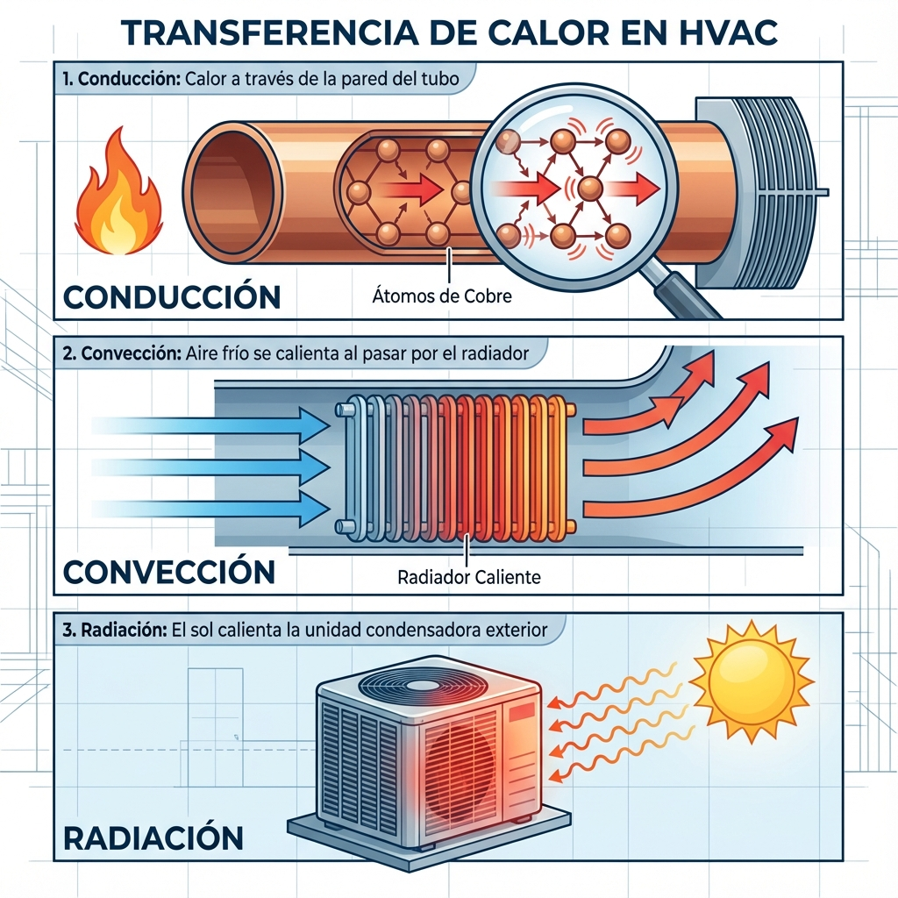
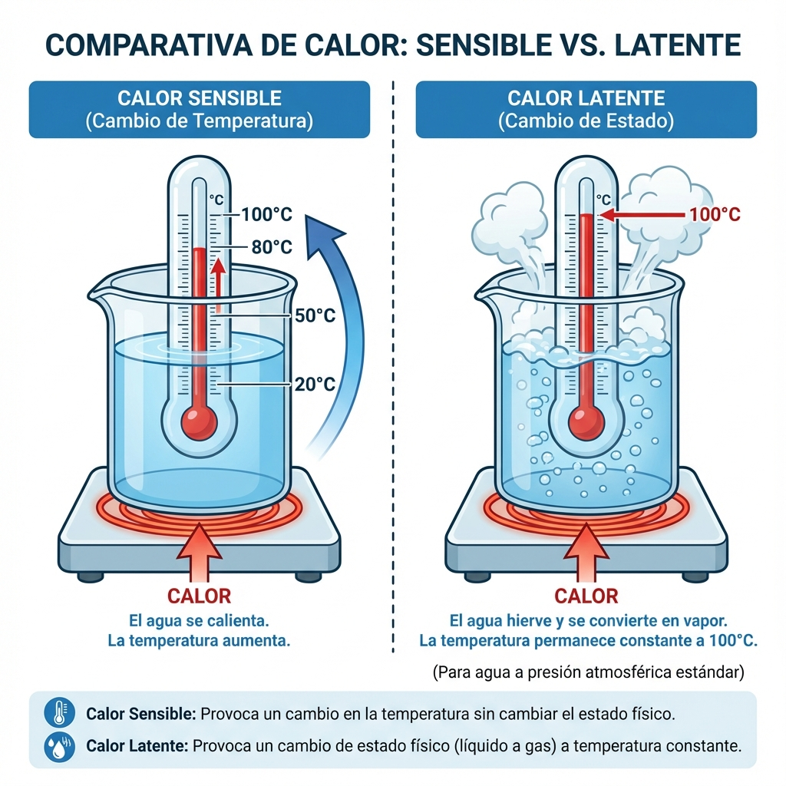

# Lección 1.1: Fundamentos de Termodinámica para Ingeniería de Climatización

> **Módulo:** 1 - Termodinámica y Psicrometría
> **Nivel:** Técnico Master / Ingeniería
> **Duración Estimada:** 3 Horas de Estudio
> **Prerrequisitos:** Matemáticas básicas y Física elemental

---

## 1. Introducción: El Rol del Técnico como Gestor de Energía

Bienvenido a la élite de la climatización. La diferencia entre un "instalador" y un "Técnico Master" radica en su comprensión de lo invisible. Mientras otros ven tubos y cables, usted aprenderá a visualizar flujos de energía, cambios de estado y diferenciales de presión.

La **Termodinámica** no es teoría abstracta; es la herramienta diagnóstica más potente que existe. Si un compresor falla, es casi seguro que hubo un problema termodinámico (retorno de líquido, alta temperatura de descarga) que causó el fallo mecánico. Entender la causa raíz requiere entender la energía.

---

## 2. La Naturaleza Molecular del Calor

### ¿Qué es el Calor?
No es un fluido. No es una sustancia.
El calor (**$Q$**) es energía en tránsito. A nivel atómico, es **energía cinética**.
*   **En Sólidos (Cobre/Aluminio):** Los átomos vibran en su sitio. Más vibración = Más temperatura.
*   **En Gases (Refrigerante):** Las moléculas viajan a alta velocidad y chocan contra las paredes de la tubería. Esos choques generan lo que medimos como "Presión".

### Temperatura vs. Calor
Es vital distinguir estos dos conceptos:
1.  **Temperatura ($T$):** Es la medida de la *intensidad* de la energía. Nos dice "hacia dónde" fluirá el calor. (Se mide con termómetro).
2.  **Calor ($Q$):** Es la *cantidad total* de energía. (Se mide en BTUs o Joules).

> **Analogía Hidráulica:**
> *   La Temperatura es como la **Altura** del agua (Presión).
> *   El Calor es como el **Volumen** de agua (Litros).
> *   *Ejemplo:* Un fósforo encendido tiene una temperatura altísima (500°C) pero poca cantidad de calor (no puede calentar una piscina). Una piscina a 30°C tiene baja temperatura, pero una cantidad masiva de calor almacenado.

---

## 3. Leyes Fundamentales de la Termodinámica (Aplicadas)

### Primera Ley: Conservación de la Energía
> *"La energía no se crea ni se destruye, solo se transforma."*

**En el Aire Acondicionado:**
El equipo no genera frío. "Frío" es solo una palabra para describir la falta de calor.
El sistema es una **Bomba de Calor**.
$$Q_{Condensador} = Q_{Evaporador} + W_{Compresor}$$
*   **$Q_{Evaporador}$:** Calor absorbido de la habitación (Carga Térmica).
*   **$W_{Compresor}$:** Energía eléctrica convertida en calor por el trabajo del motor.
*   **$Q_{Condensador}$:** Calor total que debemos tirar a la calle.

**Implicación Práctica:** El condensador siempre debe ser más grande que el evaporador porque debe deshacerse del calor del cuarto Y ADEMÁS del calor del propio motor. Si tapas el condensador, el sistema colapsa porque la energía "no tiene por dónde salir".

### Segunda Ley: Dirección del Flujo
> *"El calor fluye espontáneamente de mayor a menor temperatura."*

Para que exista transferencia, debe haber un **Delta T ($\Delta T$)**.
*   Si la habitación está a 24°C, el refrigerante DEBE estar a menos (ej. 5°C).
*   Si afuera hace 35°C, el condensador DEBE estar a más (ej. 50°C).

Entre menor sea el $\Delta T$, más lento es el enfriamiento.

---

## 4. Modos de Transferencia de Calor

El calor se mueve de tres formas. En un sistema HVAC, usamos las tres simultáneamente. Si una falla, el equipo pierde rendimiento.

### A. Conducción (Sólido a Sólido)
Es el paso de energía a través de las paredes de los tubos.
*   **Materiales:** Usamos Cobre y Aluminio porque son excelentes conductores.
*   **El Enemigo:** El sarro, el óxido y el aceite son **aislantes**.
*   *Diagnóstico:* Si un tubo de condensador está "tibio" pero el gas adentro está "hirviendo", tienes un problema de transferencia (tubos sucios por dentro o por fuera).

### B. Convección (Fluido a Superficie)
Es el transporte de calor mediante el movimiento de un fluido (Aire o Agua).
*   **Convección Forzada:** Los ventiladores (turbinas) son el motor de la convección.
*   **El Enemigo:** Filtros sucios, aspas rotas, motores lentos.
*   *Diagnóstico:* Si el aire pasa muy lento por el evaporador, el aire sale muy frío, pero el cuarto no se enfría. ¿Por qué? Porque no estás moviendo suficiente masa de aire para "barrer" el calor.

### C. Radiación (Ondas Electromagnéticas)
Calor que viaja por el espacio sin necesitar aire ni tuberías.
*   **El Sol:** La carga térmica solar es el mayor enemigo en verano. Atraviesa vidrios y calienta muebles y pisos.
*   *Consejo:* Instalar la unidad exterior (condensadora) a la sombra mejora la eficiencia hasta un 15% al evitar la radiación solar directa.

---

## 5. Calor Sensible vs. Calor Latente

Aquí reside el secreto de la eficiencia de los sistemas de compresión de vapor.

### Calor Sensible ($Q_s$) - "El que se siente"
Es la energía que hace subir o bajar la temperatura del termómetro.
*   **Fórmula:** $Q = m \cdot c_p \cdot \Delta T$
*   Se usa para bajar la temperatura del aire de 30°C a 24°C.

### Calor Latente ($Q_l$) - "El oculto"
Es la energía que hace cambiar el **estado** de la materia (Líquido $\leftrightarrow$ Gas) sin cambiar su temperatura.
*   **El Superpoder del Refrigerante:** Absorber calor hirviendo.
*   Para calentar 1 kg de agua 1°C necesitas **1 Kcal**.
*   Para evaporar 1 kg de agua (sin cambiar T°) necesitas **540 Kcal**.
*   **Conclusión:** El cambio de estado es **540 veces más potente** para mover energía que el simple cambio de temperatura. Por eso "hervimos" refrigerante en lugar de solo "circular agua fría".

---

## 6. Entropía y la "Muerte Térmica"

Un concepto avanzado para ingenieros. La **Entropía ($S$)** es la medida del desorden molecular.
*   En el aire acondicionado, siempre generamos entropía (inificiencia).
*   Cada vez que el gas pasa por una restricción o fricción, aumenta su entropía y perdemos capacidad útil.
*   Un compresor viejo con válvulas gastadas genera mucha entropía: consume mucha electricidad, calienta mucho el gas, pero comprime poco.

---

## 7. Cálculos Prácticos de Ingeniería

### Calor Específico ($c_p$)
Es la "inercia térmica" de un material. Cuánto cuesta calentarlo.
*   **Agua:** 1.0 BTU/lb·°F (Muy alto, difícil de calentar/enfriar).
*   **Aire:** 0.24 BTU/lb·°F (Muy bajo, fácil de enfriar).
*   **Cobre:** 0.09 BTU/lb·°F (Bajísimo, cambia de T° instantáneamente).

> **Ejemplo de Diagnóstico:**
> ¿Por qué usamos agua en los Chillers grandes en vez de aire? Porque el agua transporta 4 veces más calor por kilo que el aire.

### Cálculo de Carga Térmica (Simplificado)
Para enfriar un flujo de aire, usamos la fórmula psicrométrica del "4.5":
$$BTU/h = 4.5 \times CFM \times \Delta H$$
*   **CFM:** Pies cúbicos por minuto (Volumen de aire).
*   **$\Delta H$:** Cambio de Entalpía.

Esto demuestra que para enfriar más, necesitas **flujo de aire (CFM)** y **buena transferencia (Delta H)**. Si los filtros están sucios (baja CFM), la capacidad (BTU/h) se desploma.

---

## Resumen Ejecutivo para el Técnico Master

1.  **Usted gestiona calor, no frío.**
2.  **Sin flujo de aire (Convección), no hay aire acondicionado.** El ventilador es tan importante como el compresor.
3.  **El Cambio de Estado (Latente) es donde ocurre la magia.** Asegúrese de que la evaporación ocurra *dentro* del evaporador, no en la tubería de retorno.
4.  **Si no hay diferencia de temperatura, no hay intercambio.** Mantenga los serpentines limpios para maximizar esta diferencia.

En la **Lección 1.2**, aplicaremos todo esto al **Ciclo Mecánico de Refrigeración**, analizando el Diagrama de Mollier pieza por pieza.
