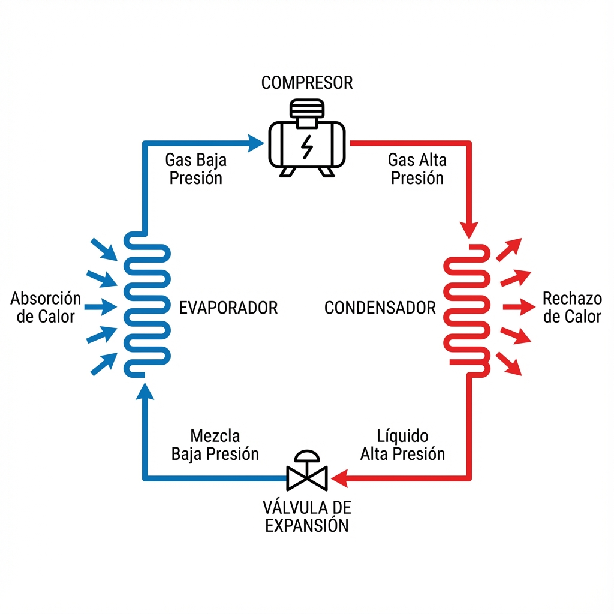

# Lección 1.2: Anatomía Profunda del Ciclo de Refrigeración (Análisis de Mollier)

> **Nivel:** Ingeniería Aplicada
> **Duración Estimada:** 2 Horas
> **Prerrequisitos:** Lección 1.1 (Termodinámica)

## 1. El Ciclo Real vs. El Ciclo Ideal

En la lección anterior vimos el concepto. Ahora veremos la realidad mecánica y termodinámica.
Un técnico cambia partes; un especialista analiza **presiones y temperaturas** para visualizar lo que ocurre dentro de la tubería sellada.

Para esto, la herramienta definitiva no es el manómetro, sino su interpretación en el **Diagrama de Mollier (Presión vs. Entalpía)**.

### Visualizando el Ciclo (Esquemático y Termodinámico)

Vamos a usar dos mapas. Uno físico (los componentes) y uno termodinámico (la energía).

**A. El Mapa Físico (Componentes)**

**B. El Mapa Termodinámico (Diagrama P-h)**
Este gráfico representa el "viaje de energía" del refrigerante.

---

## 2. Fase 1: Compresión (Trabajo Mecánico)
*Punto 1 al 2 en el Diagrama Mollier*

El compresor es una bomba de vapor. Su función no es solo "mover" el gas, sino **generar el diferencial de presión ($\Delta P$)** necesario para que el ciclo funcione.

### Física del Proceso
*   **Entrada (Succión):** El gas llega frío (aprox 4-10°C) y a baja presión. Es vital que sea 100% gas (Vapor Sobrecalentado).
*   **Proceso:** El pistón o scroll reduce el volumen del gas. Por la *Ley de los Gases Ideales ($PV=nRT$)*, al bajar el volumen, la presión y la temperatura se disparan.
*   **Salida (Descarga):** El gas sale "caliente como el infierno" (80°C - 110°C) y a alta presión.
*   **Concepto Clave: Relación de Compresión.** Es la división entre la Presión Absoluta de Descarga y la Presión Absoluta de Succión. Si esta relación es demasiado alta (ej. condensador sucio), el compresor se sobrecalienta y el aceite se quema.

> **Alerta de Diagnóstico:** Si la línea de descarga no está quemando al tacto, el compresor no está comprimiendo bien (válvulas rotas) o le está llegando líquido.

---

## 3. Fase 2: Condensación (Rechazo de Calor)
*Punto 2 al 3 en el Diagrama Mollier*

Aquí es donde pagamos la deuda energética. Debemos tirar al ambiente el calor absorbido en la habitación PLUS el calor generado por el motor del compresor.

### Sub-etapas dentro del Condensador:
1.  **Desobrecalentamiento (Desuperheating):** Primeras vueltas del serpentín. El gas baja de 90°C a 50°C (temperatura de saturación) pero sigue siendo gas.
2.  **Condensación (Cambio de Estado):** El grueso del serpentín. El gas se vuelve líquido a temperatura constante (Calor Latente).
3.  **Subenfriamiento (Subcooling):** ¡CRÍTICO! Últimas vueltas. El líquido saturado se enfría unos grados más (ej. baja de 50°C a 45°C).
    *   **¿Por qué es vital el Subcooling?** Asegura que a la válvula de expansión llegue 100% líquido puro. Si llega gas (burbujas), la válvula silba y el rendimiento cae un 40%.

---

## 4. Fase 3: Expansión (El Salto de Presión)
*Punto 3 al 4 en el Diagrama Mollier*

La Válvula de Expansión Termostática (TXV) o el dispositivo eléctronico (EEV) es el cerebro del sistema.

### ¿Qué ocurre exactamente?
Al forzar el líquido a pasar por un orificio minúsculo, la presión cae instantáneamente.
*   **Flash Gas:** Al caer la presión, una parte del líquido (aprox 20%) se evapora instantáneamente "robando" calor del resto del líquido. Esto auto-enfría el refrigerante de 45°C a 4°C en una fracción de segundo.
*   **Resultado:** Entra al evaporador una mezcla spray: 80% líquido (listo para hervir) y 20% gas.

---

## 5. Fase 4: Evaporación (Efecto Frigorífico)
*Punto 4 al 1 en el Diagrama Mollier*

El objetivo final. El refrigerante líquido hierve a baja temperatura (ej. 4°C). Al hervir, absorbe calor del aire que pasa (que está a 24°C).

### El Concepto de Superheat (Recalentamiento)
Una vez que la última gota de líquido se ha evaporado, el gas sigue recorriendo el final del serpentín y se calienta unos grados más (ej. de 4°C a 10°C).
*   **Definición:** Temperatura de Salida - Temperatura de Saturación (Manómetro).
*   **Función:** Es el seguro de vida del compresor. Asegura que no retorne ni una gota de líquido.
*   **Rango Normal:** Entre 5°C y 8°C (10-15°F) para aire acondicionado.

---

## Resumen de Variables Críticas (Tabla Maestra)

| Etapa | Estado Físico | Presión | Temperatura | Variable a Medir |
| :--- | :--- | :--- | :--- | :--- |
| **Succión** | Gas (Vapor) | Baja | Baja | **Superheat** |
| **Descarga** | Gas | Muy Alta | Muy Alta | Ratio de Compresión |
| **Líquido** | Líquido | Alta | Media/Alta | **Subcooling** |
| **Expansión** | Mezcla (Líquido+Gas) | Baja | Muy Baja | Delta T (Aire) |

Dominar el **Superheat** y el **Subcooling** es lo que separa a un profesional de un empírico. En el Módulo 2 veremos con qué herramientas exactas se miden.
