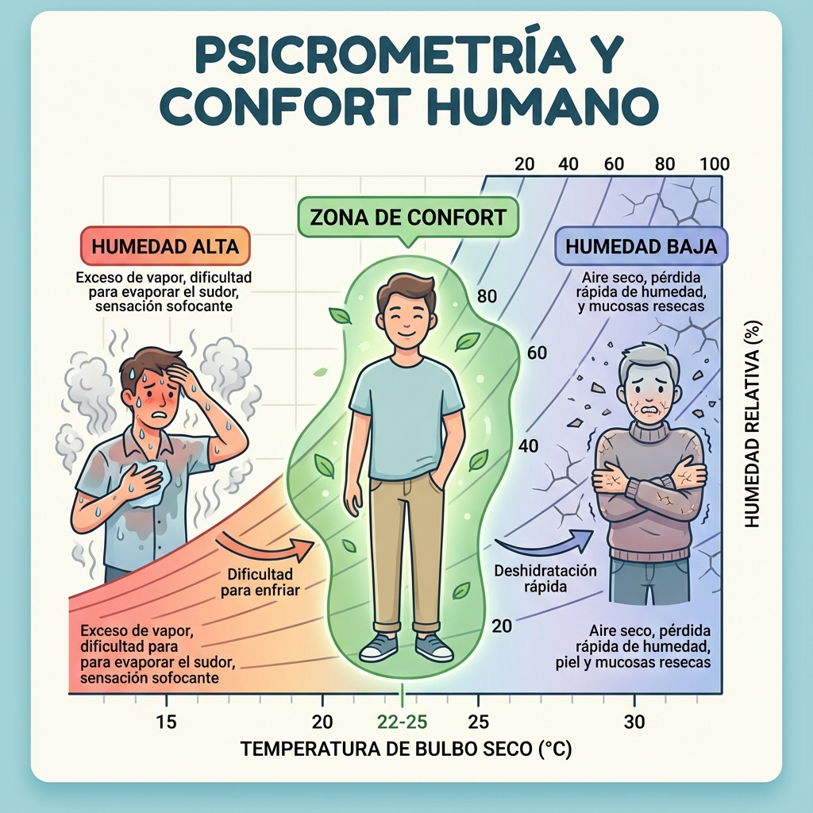

# Lección 1.3: Psicrometría Aplicada y Diagnóstico de Humedad

> **Nivel:** Ingeniería Aplicada
> **Duración Estimada:** 1.5 Horas
> **Objetivo:** Dominar la Carta Psicrométrica para resolver problemas de humedad, condensación y confort térmico (IAQ).

## 1. La Física del Aire Húmedo

Como técnicos HVAC, no movemos "aire seco"; movemos una mezcla compleja de gases (Nitrógeno, Oxígeno) y **Vapor de Agua**. Ignorar el vapor de agua es la causa #1 de las quejas de clientes tipo *"El equipo enfría pero siento calor"* o *"Hay olor a humedad"*.

### Variables Psicrométricas Fundamentales

Para definir el estado del aire necesitamos conocer al menos dos de estas variables. Con dos, podemos calcular las demás usando la **Carta Psicrométrica**.

1.  **Temperatura de Bulbo Seco (TBS):** La temperatura ambiente medida con un sensor estándar. Es una medida de *Calor Sensible*.
2.  **Temperatura de Bulbo Húmedo (TBH):** La temperatura medida con un termómetro envuelto en un paño húmedo. Es una medida de energía total (Entalpía) y capacidad de evaporación.
    *   *Depresión de Bulbo Húmedo:* Es la diferencia (TBS - TBH). Si la diferencia es grande, el aire es seco. Si es cero, la humedad es 100% (Saturación).
3.  **Punto de Rocío (Dew Point):** La temperatura a la que el aire **debe enfriarse** para que el vapor se convierta en agua líquida.
    *   *Regla de Oro:* Para deshumidificar, la temperatura de superficie del serpentín evaporador (ADP - Apparatus Dew Point) DEBE estar por debajo del Punto de Rocío del aire de retorno.
4.  **Humedad Relativa (%HR):** Relación entre la presión de vapor actual y la presión de vapor de saturación a una temperatura dada.
5.  **Humedad Específica (Granos de agua/lb):** La cantidad absoluta de agua en el aire. (Útil para cálculos de carga latente).

---

## 2. El Proceso de Deshumidificación en el A/C

¿Por qué un aire acondicionado "tira agua"? No es magia, es física.

### El Viaje del Aire por el Serpentín
1.  **Entrada:** Aire a 27°C con 60% HR (Punto de Rocío: 18°C).
2.  **Contacto:** El aire golpea las aletas del evaporador que están a 5°C.
3.  **Choque Térmico:** Como 5°C es mucho menor que 18°C (Punto de Rocío), el aire suelta su agua instantáneamente sobre el aluminio.
4.  **Salida:** El aire sale a 12°C, pero casi saturado (90% HR). Al mezclarse con el aire de la habitación, baja la temperatura promedio y la humedad absoluta del recinto.

### Problema de "Calor Latente Insuficiente" (Short Cycling)
Si instalas un equipo **sobredimensionado** (ej. 24,000 BTU en un cuarto pequeño):
*   El equipo enfría el aire a 22°C en 5 minutos y corta.
*   **Problema:** En 5 minutos, no le dio tiempo a condensar suficiente agua. El serpentín no "lloró" lo suficiente.
*   **Resultado:** Habitación fría (22°C) pero húmeda (70% HR). Sensación de "cueva fría y pegajosa".
*   **Solución:** Dimensionar correctamente (Manual J) para que el equipo corra ciclos largos (15-20 min) y pueda remover humedad.

---

## 3. Zona Efectiva de Confort (ASHRAE 55)

El confort humano depende de la evaporación del sudor.
*   **Humedad Alta (>65%):** El sudor no se evapora. El cuerpo no puede enfriarse. Sensación de sofoco aunque haya 23°C. Moho visible en paredes.
*   **Humedad Baja (<30%):** Evaporación excesiva. Piel seca, ojos rojos, descargas estáticas.
*   **Zona Ideal:**
    *   Verano: 23°C - 26°C @ 50% HR.
    *   Invierno: 20°C - 23°C @ 40% HR.

---

## 4. Instrumentación Profesional

Un técnico Master no adivina, mide.
*   **Psicrómetro Digital:** Mide Bulbo Seco y Húmedo instantáneamente y calcula %HR y Punto de Rocío.
*   **Termohigrómetro de pared:** Para monitoreo constante.

> **Ejercicio Mental:**
> Si mides una salida de aire a 10°C y el cliente se queja de que no enfría, mide el retorno. Si el retorno es 20°C, tienes un "Delta T" de 10°C. Es aceptable.
> Pero si el retorno es 28°C y la salida 24°C (Delta T bajo de 4°C), algo falla graves en el ciclo (falta de gas, compresor débil).

---

## Resumen
La psicrometría convierte una queja subjetiva ("siento calor") en un problema físico cuantificable ("Punto de Rocío alto, baja remoción de calor latente").
En la próxima lección cerraremos el módulo hablando de la Calidad de Aire Interior (IAQ), que va de la mano con la humedad.
