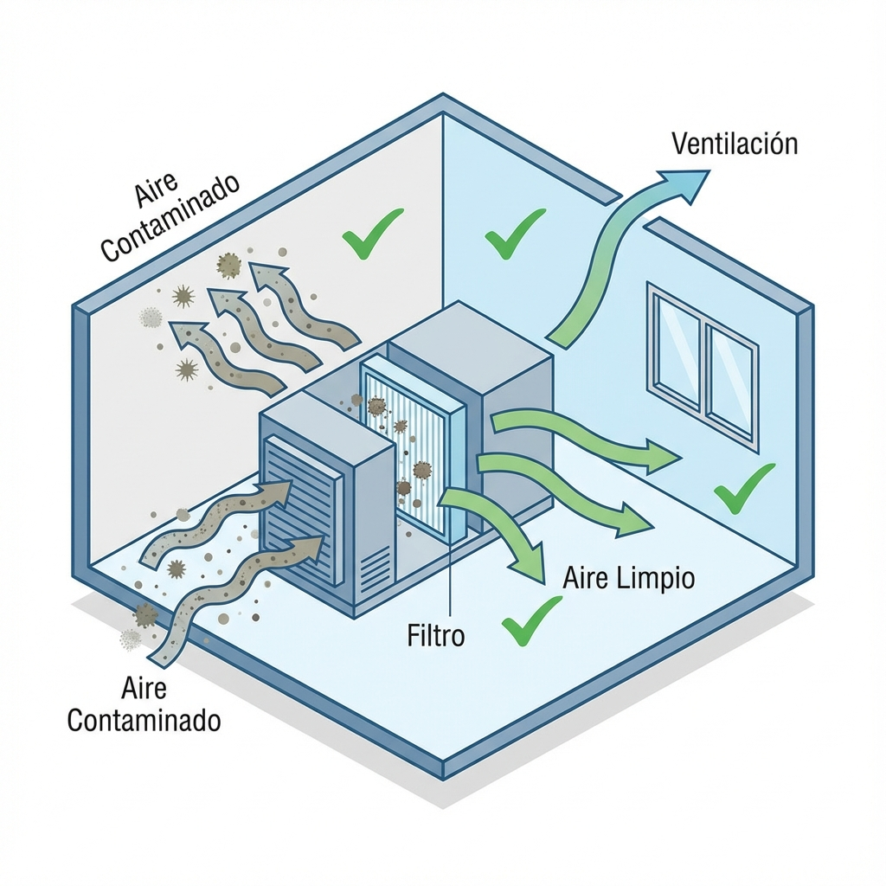

# Lección 1.4: Calidad de Aire Interior (IAQ), Filtración y Normativas

> **Nivel:** Ingeniería Aplicada (Certificación IAQ)
> **Duración Estimada:** 1 Hora
> **Objetivo:** Implementar estándares de calidad de aire para garantizar salud ocupacional y eficiencia energética.

## 1. El Nuevo Paradigma: "Edificios que Respiran"

Históricamente, el técnico de A/C solo se preocupaba por "enfriar". Hoy, pos-pandemia, el técnico es responsable de lo que la gente **respira**.
El Síndrome del Edificio Enfermo (Sick Building Syndrome) le cuesta a las empresas millones en bajas laborales. Usted es la primera línea de defensa.

### Los Contaminantes Invisibles
No solo hablamos de polvo. En el aire interior encontramos:
*   **Partículas (PM):** Polvo, polen, esporas de moho, caspa de mascotas. (Tamaño: 0.3 a 10 micras).
*   **Gases (VOCs):** Compuestos Orgánicos Volátiles. Vienen de la pintura, muebles nuevos, productos de limpieza.
*   **Biológicos:** Virus, bacterias, Legionella (mortal).

---

## 2. Filtración Avanzada: La Escala MERV

Tirar el filtro lavable y poner uno serio es la mejora más barata y efectiva.
La norma **ASHRAE 52.2** define la escala MERV (Minimum Efficiency Reporting Value).

### Guía de Selección de Filtros

| MERV | Atrapa... | Uso Recomendado |
| :--- | :--- | :--- |
| **1-4** | Pelusa, Polvo grande (>10 µm) | Protección básica del equipo (no personas). Filtros de fibra de vidrio baratos. |
| **5-8** | Ácaros, Moho, Polen (3-10 µm) | **Estándar Residencial.** Filtros plisados. |
| **9-12** | Humo fino, Polvo de plomo (1-3 µm) | Oficinas Superiores, Residencias de lujo, Alérgicos. |
| **13-16** | Bacterias, Gotículas de virus (<1 µm) | **Hospitales, Cirugía.** Cuidado: Alta caída de presión. |

> **ADVERTENCIA TÉCNICA (Caída de Presión):**
> No puedes simplemente poner un filtro MERV 16 en un Split de casa. Los filtros de alta eficiencia son "tupidos" y restringen el flujo de aire.
> *Consecuencia:* Si el motor del ventilador no tiene fuerza (Presión Estática), el flujo de aire cae, el evaporador se congela y el compresor muere. Siempre consulta el manual del fabricante antes de subir de MERV 8.

---

## 3. Ventilación Mecánica y Dilución (Norma ASHRAE 62.1)

Filtrar no es suficiente. Hay que diluir los contaminantes gaseosos (CO2, olores corporales) trayendo **Aire Fresco (Exterior)**.

### El Peligro del CO2
En un dormitorio cerrado con dos personas durmiendo, el CO2 puede subir de 400 ppm (normal) a 2000 ppm en una noche.
*   **Efectos:** Sueño no reparador, dolor de cabeza, torpeza mental.

### Soluciones Técnicas
1.  **Dampers de Aire Exterior:** En equipos comerciales (Rooftops), se ajusta una compuerta para que siempre entre un 10-20% de aire de afuera.
2.  **ERV/HRV (Recuperadores de Energía):** Intercambiadores de calor que cruzan el aire viciado que sale con el aire fresco que entra *sin mezclar sucios*, pero transfiriendo la temperatura. Así ventilas sin perder el frío.

---

## 4. Control de Humedad como Desinfectante

El moho necesita dos cosas: Comida (polvo) y Agua (Humedad).
*   Si mantienes la Humedad Relativa **por debajo del 60%**, el moho *no puede crecer*, aunque haya esporas.
*   **Luces UV-C:** Se instalan dentro del evaporador, iluminando el serpentín. La luz ultravioleta mata el ADN del moho y bacterias que intentan crecer en la oscuridad húmeda del equipo.

---

## Resumen para el Examen
1.  **MERV 8** es el estándar mínimo decente para vivienda.
2.  Más filtración = Más resistencia al aire (Cuidado con los motores).
3.  La **Ventilación** diluye el CO2; la **Filtración** atrapa partículas.
4.  La humedad controlada (<60%) es el mejor fungicida natural.

Usted no vende "aire frío", vende **Salud Ambiental**.
